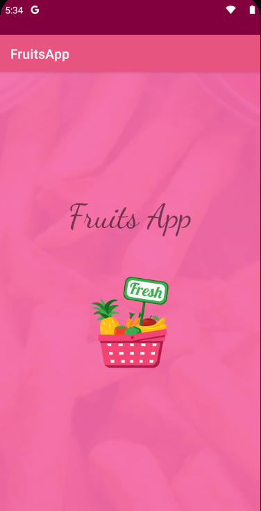
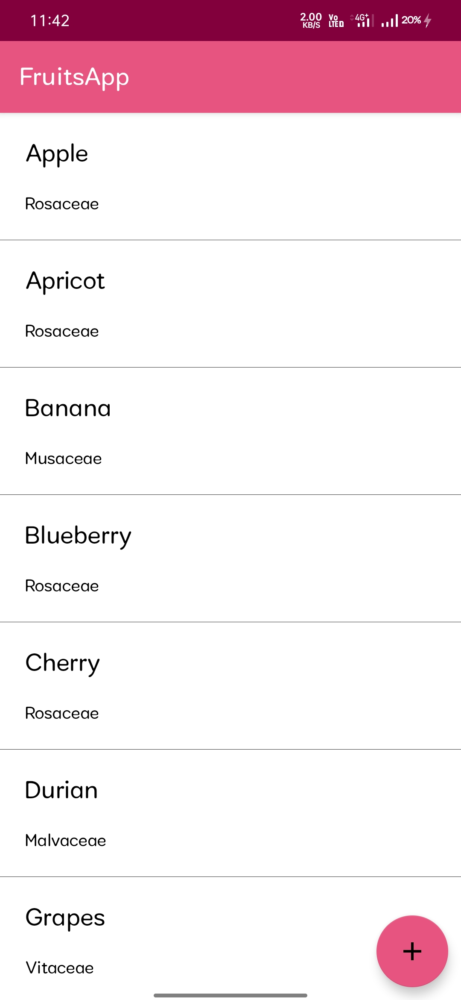
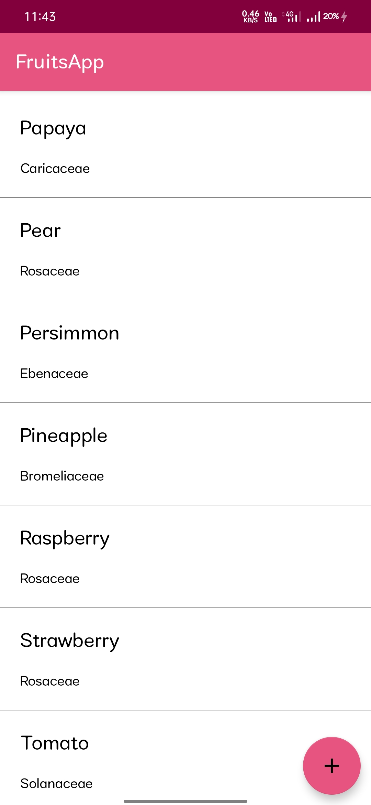
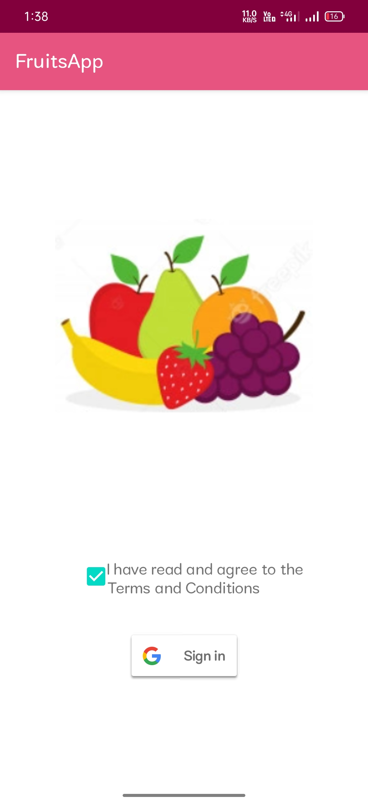
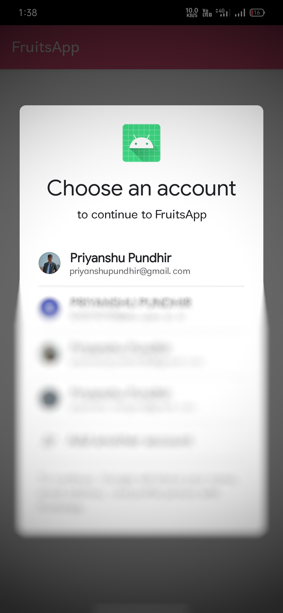
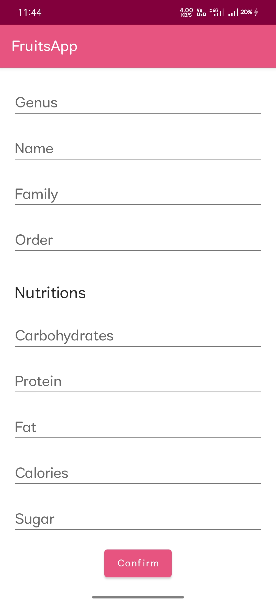
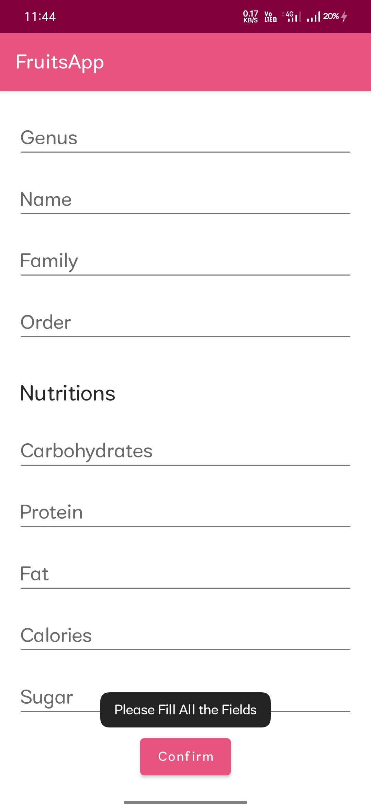
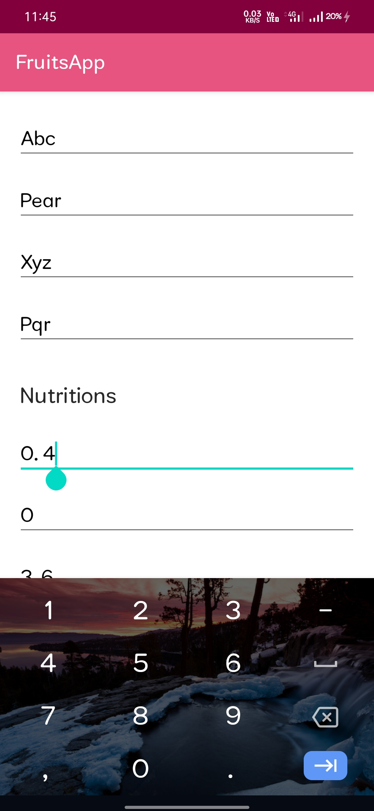
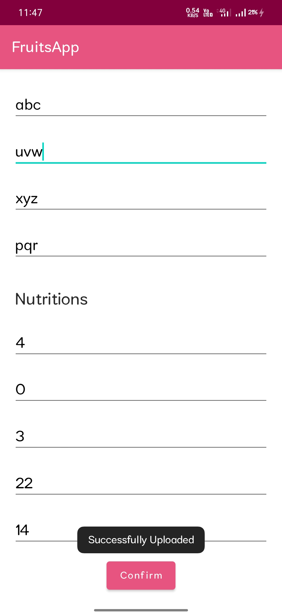

# Fruits App

This App display information about various types of fruits via fruitvice.com API, We can also add our favorite fruits on the server which are not present.
To Add a fruit User have to Sign in to the App.

Problem statement- Develop a Mobile application where users can have a look at the information of fruits displayed in a list view. 
Add a functionality where users can also add information about any other fruit which is not already available. 
To add another fruit user has to sign in/log in.

Screenshots of the App
---------------

https://user-images.githubusercontent.com/61316837/138243277-11bf9d7a-f835-4f10-a05f-1a1ee75cf26f.mp4

---------
 JSON,Parsing JSON,URL,Networking,Recycler View,Adapter,Handle Null cases,try catch finally, Activity,Manifest File,Intents,
 Event Listener,Interface,Arrays,Array List,Loops, View Recycling,List View,Custom Class,Custom Array Adapter,Assets,Constructor Overloading
